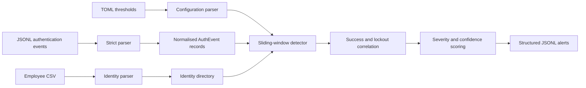

# Architecture

The first milestone is a local, deterministic detection pipeline using only synthetic data.

## Boundaries

- The detector does not authenticate users or modify accounts.
- The detector does not change the original hACL allow list.
- The detector does not ingest production healthcare or employee data.
- Thresholds are demonstration defaults, not universal security standards.
- File-integrity monitoring is a later milestone.
